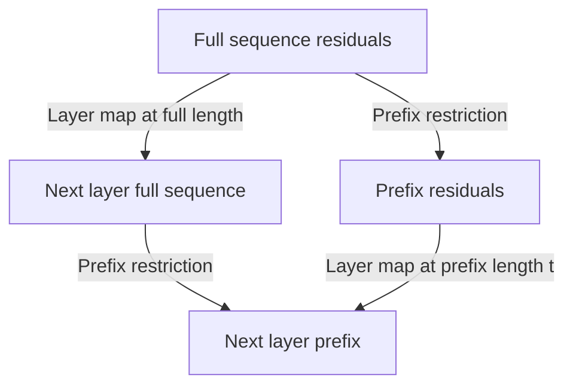
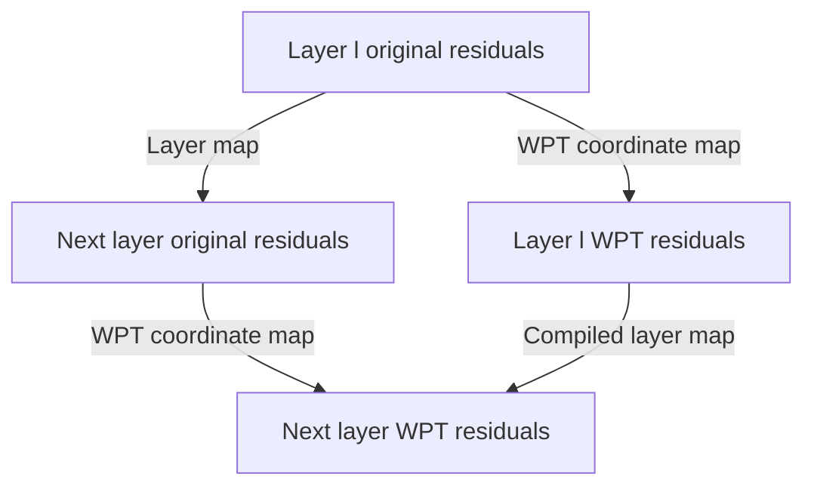
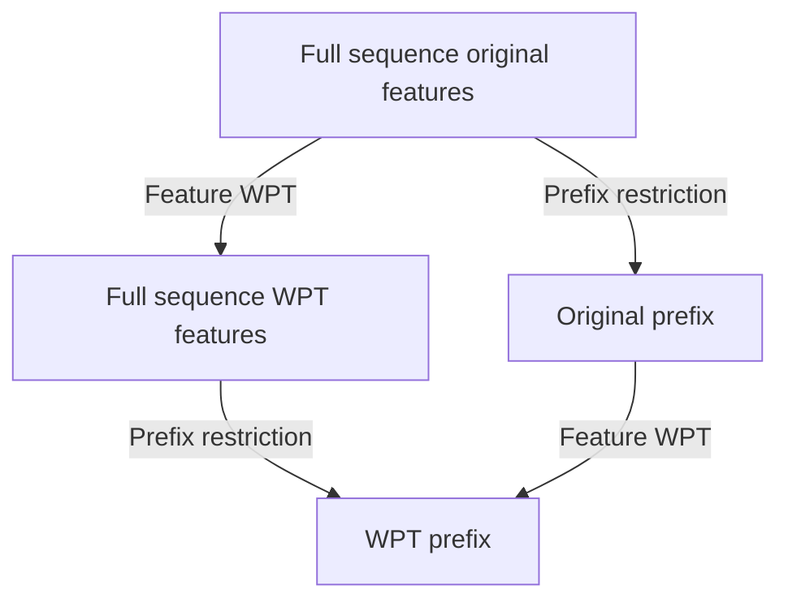

# SmolLM2-1.7B through commutative diagrams

This note presents the concrete [HuggingFaceTB/SmolLM2-1.7B configuration](https://huggingface.co/HuggingFaceTB/SmolLM2-1.7B/blob/main/config.json) as editable diagrams and equations. It is a coordinate-level aid for understanding the model and a precise vocabulary for later WPT compilation experiments; it does not claim that WPT improves this checkpoint.

The checkpoint is a `LlamaForCausalLM` configured in bf16, with vocabulary size $49{,}152$, hidden size $d=2{,}048$, MLP intermediate size $d_{ff}=8{,}192$, $24$ decoder layers, $32$ attention heads, and $32$ key/value heads. Its context limit is $8{,}192$ positions, RMSNorm epsilon is $10^{-5}$, RoPE theta is $130{,}000$, and its token embedding and language-model head are tied.

## Notation and categorical scope

For a sequence length $T$, write the residual-stream space as

$$
H_T = \mathbb{R}^{T \times 2048}.
$$

Let $\mathbf{DiffVec}_{\mathbb{R}}$ be the category whose objects are finite-dimensional real Euclidean spaces and whose morphisms are differentiable maps. This is the useful ambient category for a Transformer: RMSNorm, softmax, SiLU, and hence SwiGLU are nonlinear. A fixed decoder layer is therefore a morphism in this category, not a functor.

Let $\mathbf{L}_{24}$ be the path category with objects $0,1,\ldots,24$ and generating arrows $\ell \to \ell+1$ for $\ell=0,\ldots,23$. The sequence-level computation is represented by the layer-state functor

$$
\mathcal{H}:\mathbf{L}_{24}\longrightarrow\mathbf{DiffVec}_{\mathbb{R}},
\qquad
\mathcal{H}(\ell)=H_T,
\qquad
\mathcal{H}(\ell\to\ell+1)=L_\ell.
$$

Here $L_\ell$ is the complete decoder map at layer $\ell$. The token vocabulary can be regarded as a discrete category for diagrammatic purposes, but the learned embedding is most usefully treated as a map from one-hot token representations to $H_T$.

## Reading the model diagrams

The **residual stream** is the model's running representation: one feature row
per token. At a sequence length $T$, it is $h\in H_T=\mathbb{R}^{T\times2048}$.
Each decoder sublayer computes an update and adds it back to this running
representation. In generic form, this is $h_{\mathrm{next}}=h+\Delta(h)$.

| Term / meaning | Diagram label | Symbol / equation |
| --- | --- | --- |
| Residual stream: the current features for every token | Input, intermediate, or output residual | $h,u,h_{\ell+1}\in H_T$ |
| Residual connection: retain the old features while adding an update | Add input residual; Add intermediate residual | $h_{\mathrm{next}}=h+\Delta(h)$ |
| RMSNorm: rescales a feature vector to keep magnitudes stable | Pre-attention RMSNorm; Pre-MLP RMSNorm | $x=\operatorname{RMSNorm}(h)$ |
| Projection: a learned linear change of features | Q, K, V projections; Output projection | $xW$ |
| Q/K/V: queries ask, keys describe, and values carry information | Q, K, V projections | $Q=xW_q$, $K=xW_k$, $V=xW_v$ |
| Attention: mixes earlier token values according to query--key similarity | Causal self-attention | $\operatorname{Attn}_{\mathrm{causal}}(Q,K,V)$ |
| RoPE: position-dependent rotations applied to queries and keys | RoPE on Q and K | $\operatorname{RoPE}(Q),\operatorname{RoPE}(K)$ |
| Causal mask: prevents a position from reading future positions | Causal self-attention | attention weights for positions $j>i$ are masked |
| MLP: a per-token nonlinear feature transformation | Gate and up projections; Down projection | $\operatorname{MLP}(u)$ |
| SwiGLU: the MLP's gated nonlinearity | SwiGLU | $\operatorname{SiLU}(a)\odot b$ |
| Logits: unnormalized scores for the next token | Tied LM head | $zW_H$ |
| Category: named spaces together with permitted maps between them | Not shown as a process box | $\mathbf{DiffVec}_{\mathbb{R}}$ |
| Functor: maps layer indices and layer arrows into spaces and decoder maps | Layer-state functor | $\mathcal{H}:\mathbf{L}_{24}\to\mathbf{DiffVec}_{\mathbb{R}}$ |
| Natural transformation: the same coordinate change at every layer, compatible with layer maps | WPT coordinate map | $\eta^S:\mathcal{H}\Rightarrow\mathcal{H}^S$ |

The following symbolic square reads as: the functor $\mathcal{H}$ maps the
layer-index arrow $\ell\to\ell+1$ to the decoder-layer map
$L_\ell:H_T\to H_T$. It therefore maps both objects and arrows.

```tikz
\usepackage{tikz-cd}
\begin{document}
\begin{tikzcd}[column sep=large, row sep=large]
\ell \arrow[r, "\mathbf L_{24}"] \arrow[d, "\mathcal H"'] & \ell+1 \arrow[d, "\mathcal H"] \\
H_T \arrow[r, "L_\ell"'] & H_T
\end{tikzcd}
\end{document}
```

$$
\mathcal{H}(\ell)=H_T,
\qquad
\mathcal{H}(\ell\to\ell+1)=L_\ell.
$$

## Whole model


The embedding table has shape $W_E\in\mathbb{R}^{49152\times2048}$. With row-vector hidden states, the tied head is $W_H=W_E^\top\in\mathbb{R}^{2048\times49152}$; with column-vector conventions the displayed transposes reverse. The model computes

$$
z=\operatorname{RMSNorm}_{f}(L_{23}\circ\cdots\circ L_0(H_0)),
\qquad
p=\operatorname{softmax}(zW_H).
$$

For the row-vector embedding-table convention used here, a feature-coordinate change uses

$$
W_E^S=W_E S^\top,
\qquad
W_H^S=S W_H.
$$

Thus, when $W_H=W_E^\top$, tying is retained exactly: $(W_E^S)^\top=W_H^S$. These boundary transforms put the embedding output into WPT coordinates and map WPT-coordinate final residuals back to vocabulary logits.

## One pre-norm decoder layer

```mermaid
flowchart LR
  h[Input residual h]
  n1[Pre-attention RMSNorm]
  qkv[Q, K, V projections]
  rope[RoPE on Q and K]
  attn[Causal self-attention]
  wo[Output projection]
  add1[Add input residual]
  u[Intermediate residual u]
  n2[Pre-MLP RMSNorm]
  gu[Gate and up projections]
  swiglu[SwiGLU]
  down[Down projection]
  add2[Add intermediate residual]
  out[Output residual]
  h --> n1 --> qkv --> rope --> attn --> wo --> add1 --> u
  h --> add1
  u --> n2 --> gu --> swiglu --> down --> add2 --> out
  u --> add2
```



This companion diagram makes the two residual additions explicit: each update
takes a normalized copy of the stream, while the unchanged stream enters the
same addition node.

```tikz
\begin{document}
\begin{tikzpicture}[>=stealth]
  \node (h) at (0, 0) {$h$};
  \node[draw, rounded corners] (norm1) at (2, 0) {$\mathrm{RMSNorm}_{\ell,1}$};
  \node (x) at (3.7, 0) {$x$};
  \node[draw, rounded corners] (attn) at (6, 0) {$\Delta_{\mathrm{attn}}(x)$};
  \node[draw, circle] (plus1) at (9, 0) {$+$};
  \node (u) at (10.5, 0) {$u$};
  \node[draw, rounded corners] (norm2) at (13, 0) {$\mathrm{RMSNorm}_{\ell,2}$};
  \node (y) at (14.7, 0) {$y$};
  \node[draw, rounded corners] (mlp) at (17, 0) {$\Delta_{\mathrm{mlp}}(y)$};
  \node[draw, circle] (plus2) at (20, 0) {$+$};
  \node (hout) at (21.5, 0) {$h_{\ell+1}$};
  \draw[->] (h) -- (norm1);
  \draw[->] (norm1) -- (x);
  \draw[->] (x) -- (attn);
  \draw[->] (attn) -- (plus1);
  \draw[->] (h) to[bend left=18] (plus1);
  \draw[->] (plus1) -- (u);
  \draw[->] (u) -- (norm2);
  \draw[->] (norm2) -- (y);
  \draw[->] (y) -- (mlp);
  \draw[->] (mlp) -- (plus2);
  \draw[->] (u) to[bend right=18] (plus2);
  \draw[->] (plus2) -- (hout);
\end{tikzpicture}
\end{document}
```

$$
x=\operatorname{RMSNorm}_{\ell,1}(h),
\qquad
u=h+\Delta_{\mathrm{attn}}(x),
$$

$$
y=\operatorname{RMSNorm}_{\ell,2}(u),
\qquad
h_{\ell+1}=u+\Delta_{\mathrm{mlp}}(y).
$$

In the detailed equation below, $\Delta_{\mathrm{attn}}(x)=aW_{o,\ell}$ and
$\Delta_{\mathrm{mlp}}(y)=\bigl(\operatorname{SiLU}(yW_{\mathrm{gate},\ell})\odot(yW_{\mathrm{up},\ell})\bigr)W_{\mathrm{down},\ell}$.

For layer $\ell$, suppressing sequence and head reshapes, let

$$
\begin{aligned}
x &= \operatorname{RMSNorm}_{\ell,1}(h),\\
Q &= xW_{q,\ell},\quad K=xW_{k,\ell},\quad V=xW_{v,\ell},\\
a &= \operatorname{Attn}_{\mathrm{causal}}(\operatorname{RoPE}(Q),\operatorname{RoPE}(K),V),\\
u &= h+aW_{o,\ell},\\
y &= \operatorname{RMSNorm}_{\ell,2}(u),\\
L_\ell(h) &= u+\bigl(\operatorname{SiLU}(yW_{\mathrm{gate},\ell})\odot(yW_{\mathrm{up},\ell})\bigr)W_{\mathrm{down},\ell}.
\end{aligned}
$$

Each attention head has dimension $2048/32=64$. Because the configuration has $32$ query heads and $32$ key/value heads, this is ordinary multi-head attention (MHA), not grouped-query attention (GQA). Causal attention is nonlinear because its weights are produced by a masked softmax of $QK^\top$.

## Causality as a commuting restriction square

Let $r_t:H_T\to H_t$ retain the first $t$ positions. For a causal decoder map, the output prefix cannot depend on later input positions. This property can be displayed as the following square.



It commutes when

$$
r_t\circ L_\ell^{(T)} = L_\ell^{(t)}\circ r_t.
$$

The symbolic version uses the same spaces and arrows: either route first
applies the full/prefix layer map and then restricts, or first restricts and
then applies the prefix layer map.

```tikz
\usepackage{tikz-cd}
\begin{document}
\begin{tikzcd}[column sep=large, row sep=large]
H_T \arrow[r, "L_\ell^{(T)}"] \arrow[d, "r_t"'] & H_T \arrow[d, "r_t"] \\
H_t \arrow[r, "L_\ell^{(t)}"'] & H_t
\end{tikzcd}
\end{document}
```

This is a statement about causal position computation, not a claim that the layer is linear or time-invariant.

## Feature-space WPT as a natural coordinate change

Let $S\in\mathbb{R}^{2048\times2048}$ be an orthogonal WPT/best-basis coordinate transform on the feature axis, and apply it independently at every position:

$$
S_T=I_T\otimes S: H_T\longrightarrow H_T.
$$

An ideal exact compilation defines a compiled layer-state functor $\mathcal{H}^{S}:\mathbf{L}_{24}\to\mathbf{DiffVec}_{\mathbb{R}}$ and a natural isomorphism

$$
\eta^S:\mathcal{H}\Rightarrow\mathcal{H}^{S},
\qquad
\eta^S_\ell=S_T.
$$

Its naturality condition for each decoder edge is the coordinate-change equation

$$
S_T\circ L_\ell=L_\ell^S\circ S_T.
$$

The symbolic naturality square says that converting coordinates before or after
the corresponding layer gives the same WPT-coordinate result in the ideal
exact compilation.

```tikz
\usepackage{tikz-cd}
\begin{document}
\begin{tikzcd}[column sep=large, row sep=large]
H_T \arrow[r, "L_\ell"] \arrow[d, "\eta^S_\ell=S_T"'] & H_T \arrow[d, "\eta^S_{\ell+1}=S_T"] \\
H_T^S \arrow[r, "L_\ell^S"'] & H_T^S
\end{tikzcd}
\end{document}
```



This diagram describes the target of exact coordinate compilation. Actual implementations must establish the approximation quality numerically, including fixed-input logits and loss/perplexity differences at the stated precision.

## Attention interfaces: retain ordinary head and RoPE coordinates

The full conjugation $L_\ell^S=S_TL_\ell S_T^\top$ is a useful whole-layer idealization, but it should not be read as a license to push $S$ blindly through RMSNorm, softmax, RoPE, or SwiGLU. In particular, $S$ and $S^\top$ do not simply cancel through nonlinear operations.

A practical selective convention keeps $Q$, $K$, and $V$ in their ordinary head coordinates, so that existing head partitioning and RoPE act unchanged. For this interface calculation, use column vectors: $x^S=Sx$ and $q=W_qx$. The decoder equations above used row-vector notation only to make the sequence shapes compact. In this column-vector convention, compile the attention projections as

$$
W_q^S=W_qS^\top,
\qquad
W_k^S=W_kS^\top,
\qquad
W_v^S=W_vS^\top,
\qquad
W_o^S=SW_o.
$$

The first three maps accept a WPT-coordinate residual and emit the original $2048$-dimensional Q/K/V layout. The output projection maps the attention result back into WPT residual coordinates. This is an interface-specific compilation rule, distinct from claiming a full end-to-end layer conjugation.

### Exact coordinate change versus an unchanged Llama block

As a general differentiable-map coordinate change, an exact compiled layer can always be *defined* by

$$
L_\ell^S=S_TL_\ell S_T^\top.
$$

That definition does not mean that $L_\ell^S$ remains a Llama block with unchanged RMSNorm and SwiGLU structure. In particular, the learned diagonal RMSNorm scale $D_\gamma$ becomes $SD_\gamma S^\top$, which is generally dense for a nontrivial feature WPT. Likewise, conjugating elementwise SiLU, SwiGLU, and their gating produces cross-channel nonlinear maps. Consequently, merely precompiling $Q/K/V/O$ projections does not in general implement the exact $L_\ell^S$, nor can exact $L_\ell^S$ generally be represented using unchanged Llama RMSNorm/SwiGLU parameters.

The numerical equivalence checks in this note therefore apply to any implementation that claims an architecture-preserving exact compilation or a stated approximation; they are not implied by the diagram alone.

## Feature WPT and causal prefixes together

Because the feature transform acts independently at each position, it commutes with prefix restriction. With $S_t=I_t\otimes S$,

$$
r_t\circ S_T=S_t\circ r_t.
$$



Consequently, a feature-axis WPT does not relax the checkpoint's ordinary causal mask. A sequence-axis WPT or hierarchical block-causal method is a separate architectural proposal: it mixes positions and is not automatically causal, so its mask and generation semantics must be specified and tested independently.

## Limits and use in experiments

- These diagrams identify spaces and coordinate relations; they do not establish a speedup, quality preservation, or better continual learning.
- Exact coordinate compilation, approximate masking/pruning, quantization, and custom kernels are different claims and require separate measurements.
- A sparse or near-block-diagonal representation is useful only if the measured structure survives the chosen basis, thresholds, and hardware kernel.

## Viewing in VS Code

Modern VS Code Markdown Preview renders Mermaid fenced blocks. The installed TikZJax / TikZ in Markdown extension renders the `tikz` fences in this note and supports `tikz-cd` for the commutative squares. The surrounding equations use standard `$...$` and `$$...$$` delimiters supported by the normal Markdown math workflow.
