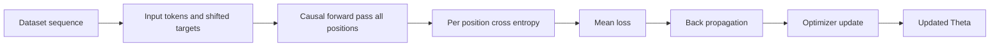
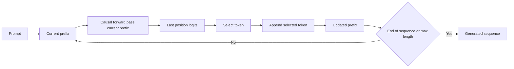
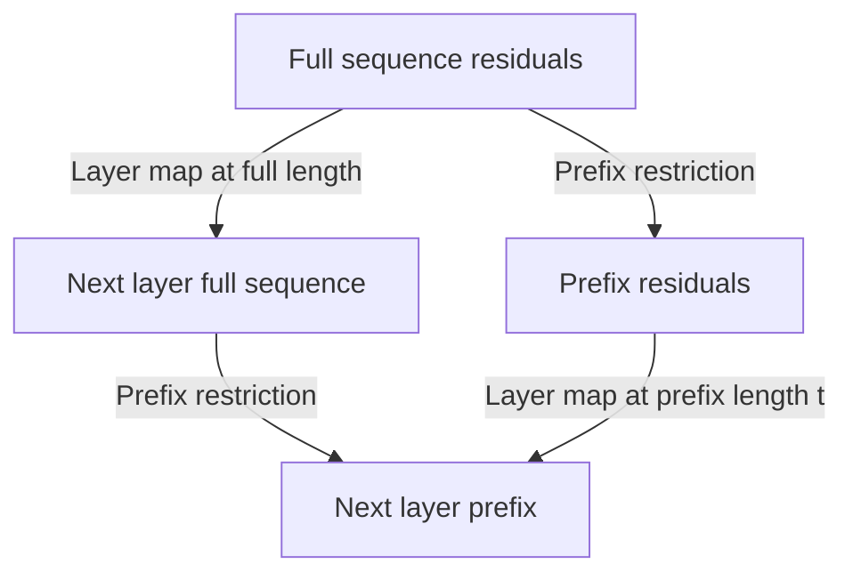
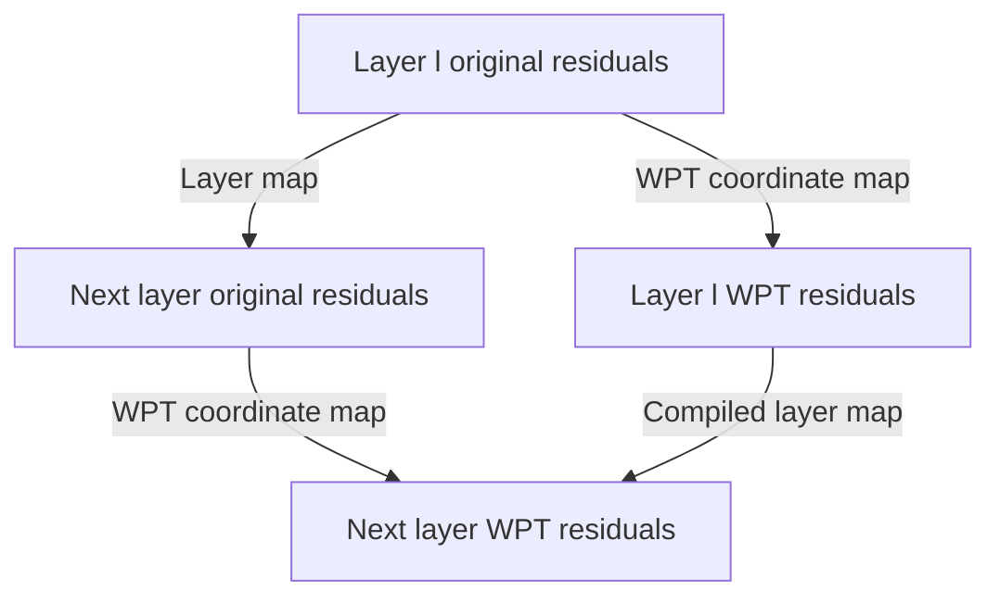
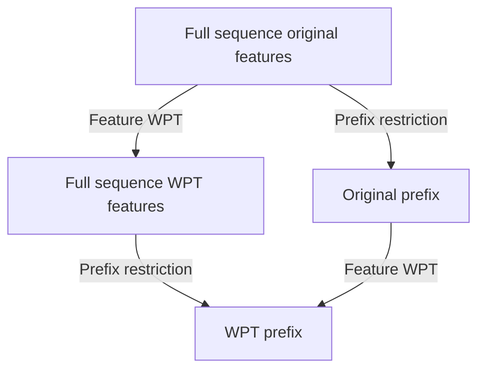

```mermaid
flowchart LR
  h[Input residual h]
  n1[Pre-attention RMSNorm]
  qkv[Q, K, V projections]
  rope[RoPE on Q and K]
  attn[Causal self-attention]
  wo[Output projection]
  add1[Add input residual]
  u[Intermediate residual u]
  n2[Pre-MLP RMSNorm]
  gu[Gate and up projections]
  swiglu[SwiGLU]
  down[Down projection]
  add2[Add intermediate residual]
  out[Output residual]
  h --> n1 --> qkv --> rope --> attn --> wo --> add1 --> u
  h --> add1
  u --> n2 --> gu --> swiglu --> down --> add2 --> out
  u --> add2
```

# SmolLM2-1.7B through commutative diagrams

This note presents the concrete [HuggingFaceTB/SmolLM2-1.7B configuration](https://huggingface.co/HuggingFaceTB/SmolLM2-1.7B/blob/main/config.json) as editable diagrams and equations. It is a coordinate-level aid for understanding the model and a precise vocabulary for later WPT compilation experiments; it does not claim that WPT improves this checkpoint.

## Orientation: what this model does

A decoder-only language model maps supplied token IDs $x_{1:T}$ to one
distribution over its vocabulary at every position. The distribution at
position $t$ is its prediction for the next token, conditioned only on the
prefix $x_{1:t}$. In symbols,

$$
x_{1:T}\longmapsto
\left(p_\Theta(\cdot\mid x_{1:1}),\ldots,
p_\Theta(\cdot\mid x_{1:T})\right).
$$

The surrounding text boundary is deliberately separate from the neural
network: raw text is converted by a tokenizer into token IDs, which are the
network input. During generation, selected output IDs are converted back to
text by the matching detokenizer:

$$
\text{raw text}\xrightarrow{\mathrm{tokenizer}}x_{1:T}
\xrightarrow{\mathrm{model}}\text{next-token distributions}
\xrightarrow{\mathrm{selection}}\text{generated IDs}
\xrightarrow{\mathrm{detokenizer}}\text{raw text}.
$$

SmolLM2-1.7B is a `LlamaForCausalLM` configured in bf16. It has a vocabulary
of $49{,}152$ tokens, $d=2{,}048$ feature coordinates per token, $24$ decoder
layers, $32$ attention heads of dimension $2048/32=64$, and an MLP width of
$d_{ff}=8{,}192$. It has $32$ key/value heads, an $8{,}192$-position context
limit, RMSNorm epsilon $10^{-5}$, RoPE theta $130{,}000$, and tied token
embedding and language-model-head weights.

There are two uses of this same mapping. A supplied sequence forward pass
computes all of its position-wise predictions together, subject to the causal
mask. Autoregressive generation repeatedly takes only the final prediction,
chooses a token, appends it to the prefix, and runs another step. The first
half of this note follows one supplied forward computation; the later
training-and-generation section explains these two uses of it.

## Data, spaces, and geometry

Let $V=49{,}152$ be the vocabulary size. At position $t$, let $v_t$ be the
integer **token ID** supplied by the tokenizer; its one-hot row vector is
$e_{v_t}^\top\in\mathbb{R}^{1\times V}$. The learned embedding table is

$$
W_E\in\mathbb{R}^{V\times2048},
\qquad
h_t^{(0)}=e_{v_t}^\top W_E\in\mathbb{R}^{1\times2048}.
$$

The subscript $t$ names a **position in the sequence**, whereas $v_t$ selects
a vocabulary row. The same token ID may occur at several positions, so this
distinction matters: it begins with the same embedding vector but is later
given position-dependent context by RoPE and causal attention.

For $T$ tokens, stacking these rows gives the initial residual stream

$$
H_0\in H_T=\mathbb{R}^{T\times2048}.
$$

Rows are token positions and columns are feature coordinates. Computationally,
the token axis says *which positions may communicate*; the feature axis is
where learned linear maps and nonlinear feature transformations act.
Geometrically, each row is a point/vector in a learned $2048$-dimensional
feature space. Its coordinate axes are learned feature directions, not
human-labelled concepts. Attention can mix information across permitted rows;
per-token maps move or reshape a row within its feature space. Residual sums
always return an update to the same common space $H_T$, which is why the model
can stack layers.

This note uses the **row-vector convention**: a feature map is written on the
right, as $xW$. The output after the final normalization has shape
$Z\in\mathbb{R}^{T\times2048}$ and produces vocabulary logits

$$
\operatorname{logits}=ZW_H\in\mathbb{R}^{T\times V},
\qquad
p_t=\operatorname{softmax}(\operatorname{logits}_t)\in\Delta^{V-1},
$$

where $\Delta^{V-1}$ is the probability simplex: nonnegative length-$V$
vectors whose entries sum to one. The head has shape
$W_H\in\mathbb{R}^{2048\times V}$. SmolLM2 ties it to the input table,
$W_H=W_E^\top$; the same learned vectors are read one way to embed a token and
the transposed way to score possible output tokens. A column-vector treatment
would put feature matrices on the left and reverse the displayed transposes;
it describes the same computation.

## Reading the model diagrams: mechanics glossary

The **residual stream** is the model's running representation: one feature row
per token. At a sequence length $T$, it is $h\in H_T=\mathbb{R}^{T\times2048}$.
Each decoder sublayer computes an update and adds it back to this running
representation. In generic form, this is $h_{\mathrm{next}}=h+\Delta(h)$.

| Term / meaning | Diagram label | Symbol / equation |
| --- | --- | --- |
| Residual stream: the current features for every token | Input, intermediate, or output residual | $h,u,h_{\ell+1}\in H_T$ |
| Residual connection: retain the old features while adding an update | Add input residual; Add intermediate residual | $h_{\mathrm{next}}=h+\Delta(h)$ |
| RMSNorm: rescales a feature vector to keep magnitudes stable | Pre-attention RMSNorm; Pre-MLP RMSNorm | $x=\operatorname{RMSNorm}(h)$ |
| Projection: a learned linear change of features | Q, K, V projections; Output projection | $xW$ |
| Q/K/V: queries ask, keys describe, and values carry information | Q, K, V projections | $Q=xW_q$, $K=xW_k$, $V=xW_v$ |
| Attention: mixes earlier token values according to query--key similarity | Causal self-attention | $\operatorname{Attn}_{\mathrm{causal}}(Q,K,V)$ |
| RoPE: position-dependent rotations applied to queries and keys | RoPE on Q and K | $\operatorname{RoPE}(Q),\operatorname{RoPE}(K)$ |
| Causal mask: prevents a position from reading future positions | Causal self-attention | attention weights for positions $j>i$ are masked |
| MLP: a per-token nonlinear feature transformation | Gate and up projections; Down projection | $\operatorname{MLP}(u)$ |
| SwiGLU: the MLP's gated nonlinearity | SwiGLU | $\operatorname{SiLU}(a)\odot b$ |
| Logits: unnormalized scores for the next token | Tied LM head | $zW_H$ |
## Whole model: one causal forward computation


The embedding and tied head are the data-space boundary maps described above.
Between them, every decoder layer maps $H_T$ back to $H_T$: the representation
keeps one row per token and $2048$ feature coordinates per row. Within a layer,
attention communicates across allowed rows; normalization, projections, and
the MLP transform feature coordinates. The complete supplied-sequence forward
map computes

$$
z=\operatorname{RMSNorm}_{f}(L_{23}\circ\cdots\circ L_0(H_0)),
\qquad
p=\operatorname{softmax}(zW_H).
$$

Equivalently, the data flow in the whole-model diagram is the symbolic chain

$$
H_0\xrightarrow{L_0}\cdots\xrightarrow{L_{23}}H_{24}
\xrightarrow{\operatorname{RMSNorm}_f}z
\xrightarrow{\,W_H\,}\operatorname{logits}
\xrightarrow{\operatorname{softmax}}p.
$$

## One decoder layer: feature maps and position mixing

A pre-norm decoder layer has two complementary mechanisms. RMSNorm,
projections, and the MLP act on the feature coordinates of each row. Attention
first turns rows into queries, keys, and values, then uses query--key scores to
mix values across only the token positions permitted by the causal mask. Both
updates are added to the residual stream, returning to $H_T$ after each step.
Thus the diagram is both computational and geometric: arrows along a row are
feature-space transformations, while causal attention is the route by which
information can move between rows.



This companion diagram makes the two residual additions explicit. The
unnormalized stream $h$ bypasses the first update, while its normalized copy
$x$ supplies attention; analogously, $u$ bypasses the MLP update while its
normalized copy $y$ supplies the MLP.

```tikz
\begin{document}
\begin{tikzpicture}[>=stealth]
  \node (h) at (0, 0) {$h$};
  \node[draw, rounded corners] (norm1) at (2, 0) {$\mathrm{RMSNorm}_{\ell,1}$};
  \node (x) at (3.7, 0) {$x$};
  \node[draw, rounded corners] (attn) at (6, 0) {$\Delta_{\mathrm{attn}}(x)$};
  \node[draw, circle] (plus1) at (9, 0) {$+$};
  \node (u) at (10.5, 0) {$u$};
  \node[draw, rounded corners] (norm2) at (13, 0) {$\mathrm{RMSNorm}_{\ell,2}$};
  \node (y) at (14.7, 0) {$y$};
  \node[draw, rounded corners] (mlp) at (17, 0) {$\Delta_{\mathrm{mlp}}(y)$};
  \node[draw, circle] (plus2) at (20, 0) {$+$};
  \node (hout) at (21.5, 0) {$h_{\ell+1}$};
  \draw[->] (h) -- (norm1);
  \draw[->] (norm1) -- (x);
  \draw[->] (x) -- (attn);
  \draw[->] (attn) -- (plus1);
  \draw[->] (h) to[bend left=18] (plus1);
  \draw[->] (plus1) -- (u);
  \draw[->] (u) -- (norm2);
  \draw[->] (norm2) -- (y);
  \draw[->] (y) -- (mlp);
  \draw[->] (mlp) -- (plus2);
  \draw[->] (u) to[bend right=18] (plus2);
  \draw[->] (plus2) -- (hout);
\end{tikzpicture}
\end{document}
```

$$
x=\operatorname{RMSNorm}_{\ell,1}(h),
\qquad
u=h+\Delta_{\mathrm{attn}}(x),
$$

$$
y=\operatorname{RMSNorm}_{\ell,2}(u),
\qquad
h_{\ell+1}=u+\Delta_{\mathrm{mlp}}(y).
$$

In the detailed equation below, $\Delta_{\mathrm{attn}}(x)=aW_{o,\ell}$ and
$\Delta_{\mathrm{mlp}}(y)=\bigl(\operatorname{SiLU}(yW_{\mathrm{gate},\ell})\odot(yW_{\mathrm{up},\ell})\bigr)W_{\mathrm{down},\ell}$.

For layer $\ell$, suppressing sequence and head reshapes, let

$$
\begin{aligned}
x &= \operatorname{RMSNorm}_{\ell,1}(h),\\
Q &= xW_{q,\ell},\quad K=xW_{k,\ell},\quad V=xW_{v,\ell},\\
a &= \operatorname{Attn}_{\mathrm{causal}}(\operatorname{RoPE}(Q),\operatorname{RoPE}(K),V),\\
u &= h+aW_{o,\ell},\\
y &= \operatorname{RMSNorm}_{\ell,2}(u),\\
L_\ell(h) &= u+\bigl(\operatorname{SiLU}(yW_{\mathrm{gate},\ell})\odot(yW_{\mathrm{up},\ell})\bigr)W_{\mathrm{down},\ell}.
\end{aligned}
$$

For this concrete checkpoint, the combined attention matrices have shapes

$$
W_{q,\ell},W_{k,\ell},W_{v,\ell},W_{o,\ell}
\in\mathbb{R}^{2048\times2048},
$$

and the MLP matrices have shapes

$$
W_{\mathrm{gate},\ell},W_{\mathrm{up},\ell}
\in\mathbb{R}^{2048\times8192},
\qquad
W_{\mathrm{down},\ell}\in\mathbb{R}^{8192\times2048}.
$$

RMSNorm is also a per-row feature operation. With learned scale
$\gamma_{\ell,j}\in\mathbb{R}^{2048}$ for its particular normalization site,
the row-vector convention writes

$$
\operatorname{RMSNorm}_{\ell,j}(h_i)
=
\gamma_{\ell,j}\odot
\frac{h_i}{\sqrt{\frac{1}{2048}\sum_{c=1}^{2048}h_{i,c}^2+\epsilon}},
\qquad
\gamma_{\ell,j}\in\mathbb{R}^{2048}.
$$

There is no mixing of token rows in this expression: it rescales the feature
coordinates of row $i$ using that row's root-mean-square magnitude.

### Attention and MLP: what moves where

The query $Q$ represents what each position is looking for; the key $K$
represents what each position offers; and the value $V$ is the information that
may be carried from a source position. Each combined $T\times2048$ projection
is partitioned into $32$ heads, so $Q^r,K^r,V^r\in\mathbb{R}^{T\times64}$ for
head $r$. RoPE applies a position-dependent rotation within those $64$-
dimensional head subspaces to $Q^r$ and $K^r$; write the resulting matrices as
$\widetilde Q^r=\operatorname{RoPE}(Q^r)$ and
$\widetilde K^r=\operatorname{RoPE}(K^r)$. With causal mask
$M\in\mathbb{R}^{T\times T}$, whose forbidden future entries are effectively
$-\infty$, the concrete row-convention calculation is

$$
A^r=\operatorname{softmax}\!\left(
\frac{\widetilde Q^r(\widetilde K^r)^\top}{\sqrt{64}}+M\right)
\in\mathbb{R}^{T\times T},
\qquad
O^r=A^rV^r\in\mathbb{R}^{T\times64},
$$

$$
a=\operatorname{Concat}(O^1,\ldots,O^{32})\in\mathbb{R}^{T\times2048},
\qquad
u=h+aW_{o,\ell}.
$$

Each row of $A^r$ is a causal probability distribution over **source token
positions**: it has nonnegative entries summing to one, and assigns zero
probability to future positions. Multiplication by $A^r$ is therefore the
specific operation that moves information across token rows in the layer.

The output projection returns the concatenated head result to the
$2048$-coordinate residual space. The MLP then acts independently at each
position: its gate and up projections expand a row into the $8192$-wide
intermediate feature space, SiLU and elementwise multiplication provide the
gated nonlinearity, and the down projection returns to $2048$ coordinates.
Because the configuration has $32$ query heads and $32$ key/value heads, this
is ordinary multi-head attention (MHA), not grouped-query attention (GQA).

## Causal prediction: training and generation

The training and generation processes below are two uses of the same causal
forward graph. The difference is in where the next token comes from and
whether a loss/gradient update is performed, not in the decoder-layer
mechanics above.

The decoder receives a supplied sequence of token IDs $x_{1:T}$ and produces
one logit vector at every position, $z_{1:T}$. Its next-token distribution at
position $t$ is

$$
p_\Theta(x_{t+1}\mid x_{1:t})=\operatorname{softmax}(z_t),
$$

where $\Theta$ denotes all learned parameters. The causal mask allows position
$t$ to use only $x_{1:t}$, never a later token. When the entire input sequence
is already known, however, all positions can still be evaluated in parallel:
causality restricts *dependencies*, not the hardware execution schedule.

### Training

During training, a dataset supplies both the input prefix tokens and the
**shifted targets**. For example, inputs $x_{1:T}$ have targets
$x_{2:T+1}$. The model never samples those targets; this is commonly called
teacher forcing.



The mean next-token cross-entropy loss is

$$
\mathcal{L}(\Theta)=-\frac{1}{T}\sum_{t=1}^{T}
\log p_\Theta(x_{t+1}\mid x_{1:t}),
\qquad
\Theta\leftarrow\operatorname{Optimizer}\!\left(\Theta,
\nabla_\Theta\mathcal{L}\right).
$$

Thus teacher forcing can evaluate every position and its target in parallel,
then use back-propagation and an optimizer to update $\Theta$.

### Generation

Generation begins from a prompt or other current prefix. The model evaluates
that prefix, selects only the final-position prediction, appends it, and repeats
until an end-of-sequence token or the chosen maximum length.



For a selection policy $q$, the selected token is

$$
x_{T+1}=\operatorname{Select}_q\!\left(\operatorname{softmax}(z_T)\right).
$$

Here $q$ can be a deterministic greedy argmax policy or a stochastic sampler,
such as one using temperature and top-$p$ filtering. When the stop check is
negative, the updated prefix becomes the next current prefix.

Ordinary inference keeps $\Theta$ fixed: there is no loss, back-propagation,
or parameter update. A **KV cache** stores the key and value projections from
earlier positions in each layer. After the prompt prefill, a new iteration
processes the new token rather than recomputing the old prefix. It gives the
same causal result as an uncached evaluation, apart from ordinary
numerical/runtime implementation differences.

In short, training and generation share the same causal model and mask.
Training uses dataset targets, losses, gradients, and updates; generation uses
selected and appended tokens, with no updates.

### Fold, unfold, and build

These words provide an operational way to read the two processes. During
training, the known token sequence lets the causal predictor produce one loss
$\ell_t$ at every predicted position. A **fold** combines that collection of
per-token losses into one scalar objective, usually by a sum or mean. Because
each layer has its own parameters but reuses them at every token position, the
per-position gradient contributions sum or average for that layer's shared
parameters. Explicitly tied parameters, such as tied embeddings and the LM
head, likewise receive contributions from every use.

During generation, the current prefix is the state. One causal forward pass
and a selection rule emit a next token; **build** appends that token to form the
next prefix. An **unfold** repeats this state transition until the stop token
or length limit is reached. The causal predictor is the same in both cases:
training is given the next token by the dataset, while generation selects and
appends it.


For a mean reduction, the training fold can be written as

$$
\ell_t(\Theta)=-\log p_\Theta(x_{t+1}\mid x_{1:t}),
\qquad
\mathcal{L}(\Theta)=\frac{1}{T}\sum_{t=1}^{T}\ell_t(\Theta).
$$

The generation state transition is

$$
s_t=x_{1:t},
\qquad
\hat{x}_{t+1}=\operatorname{Select}_q\!\left(p_\Theta(\cdot\mid s_t)\right),
\qquad
s_{t+1}=\operatorname{Build}(s_t,\hat{x}_{t+1}).
$$

### Programs and equations

The following language-neutral pseudocode is an operational reading of the
equations, not executable library code. The equations remain the precise
definition; names such as `map`, `mean`, `fold`, and `unfold` make the data
flow explicit.

For teacher-forced training, take a dataset sequence
$\mathrm{tokens}=(x_1,\ldots,x_{T+1})$. The inputs
`tokens[0:-1]` are $x_{1:T}$ and the supplied shifted targets `tokens[1:]`
are $x_{2:T+1}$. The model predicts at every position in parallel under the
causal mask; it does not generate those targets.

```text
teacherForcedLoss(theta, tokens):
  logits = causalForward(theta, tokens[0:-1])
  shiftedTargets = tokens[1:]
  losses = map((logitsAtPosition, target) ->
                 crossEntropy(logitsAtPosition, target),
               zip(logits, shiftedTargets))
  return mean(losses)              # equivalently: fold(+, losses) / count(losses)

trainStep(theta, tokens, optimizer):
  loss, gradTheta = valueAndGrad(theta -> teacherForcedLoss(theta, tokens), theta)
  return optimizerStep(optimizer, theta, gradTheta), loss
```

Here the `map` produces the per-position terms and the `mean` is the loss
fold. In the notation used above, this program computes

$$
\mathcal{L}(\Theta)
=-\frac{1}{T}\sum_{t=1}^{T}
  \log p_\Theta(x_{t+1}\mid x_{1:t}).
$$

Generation instead unfolds a changing prefix. The selection policy
`selectQ` may be greedy or stochastic, but ordinary generation keeps
$\Theta$ fixed and never calls an optimizer.

```text
step(theta, prefix):
  logits = causalForward(theta, prefix)
  nextToken = selectQ(softmax(last(logits)))
  return append(prefix, nextToken)

generate(theta, prompt, stop, maxNewTokens):
  return unfoldUntil(prefix -> step(theta, prefix),
                     prompt,
                     prefix -> stop(last(prefix))
                               or generatedCount(prefix, prompt) == maxNewTokens)
```

`unfoldUntil` returns the sequence of prefixes, including the initial prompt
and the terminal prefix that first satisfies its predicate. The state in this
program is the prefix $s_t=x_{1:t}$, and its transition is

$$
s_{t+1}=\operatorname{Build}\!\left(
  s_t,
  \operatorname{Select}_q\!\left(p_\Theta(\cdot\mid s_t)\right)
\right).
$$

`valueAndGrad` can itself be understood as a transformation of the forward
loss program. Conceptually, it makes a forward trace, seeds an adjoint map at
the scalar loss with $1$, and reverse-folds local vector--Jacobian products
(VJPs). Implementations may record intermediates, recompute them, or use a
framework tape; this pseudocode is an explanation rather than a literal API.

```text
valueAndGrad(lossFunction, theta):
  loss, trace = forwardTrace(lossFunction, theta)
  adjoints = {loss: 1}
  adjoints = reverseFold(accumulateVjpAdjoints, adjoints, reverse(trace))
  return loss, adjoints[theta]

accumulateVjpAdjoints(adjoints, operation):
  outputAdjoint = adjoints[operation.output]
  inputAdjoints, parameterAdjoints = vjp(operation, outputAdjoint)
  for input, inputAdjoint in zip(operation.inputs, inputAdjoints):
    adjoints[input] += inputAdjoint
  for parameter, parameterAdjoint in zip(operation.parameters, parameterAdjoints):
    adjoints[parameter] += parameterAdjoint
  return adjoints
```

For a recorded operation $h_i=f_i(h_{i-1},\theta_i)$, the corresponding local
reverse step is exactly the VJP relation used below:

$$
(\bar h_{i-1},\bar\theta_i)
\mathrel{+}=
\operatorname{VJP}_{f_i}(h_{i-1},\theta_i;\bar h_i).
$$

The explicit `+=` is essential: a shared parameter is used by many operations
(for example, at multiple token positions), so each use contributes a local
gradient term to the same entry in `adjoints[theta]`.

### No magic: reverse-mode automatic differentiation

The forward model is a composition of ordinary operations. In schematic form,
it computes

$$
h_0 \xrightarrow{f_1} h_1 \xrightarrow{f_2} \cdots
\xrightarrow{f_n} h_n \xrightarrow{\ell} \mathcal{L}.
$$

The forward pass records, or later recomputes, the intermediate values needed
by the local derivatives. Saving fewer values and recomputing some of them is
an implementation memory optimization often called checkpointing; it does not
change the derivative being computed. Reverse-mode automatic differentiation
then traverses the same operations in reverse.

```tikz
\begin{document}
\begin{tikzpicture}[>=stealth]
  \node (h0) at (0, 0) {$h_0$};
  \node[draw, rounded corners] (f1) at (2, 0) {$f_1$};
  \node (h1) at (4, 0) {$h_1$};
  \node[draw, rounded corners] (fn) at (7, 0) {$f_n$};
  \node (hn) at (9, 0) {$h_n$};
  \node[draw, rounded corners] (ell) at (11, 0) {$\ell$};
  \node (loss) at (13, 0) {$\mathcal{L}$};
  \draw[->] (h0) -- (f1);
  \draw[->] (f1) -- (h1);
  \draw[->] (h1) -- (fn);
  \draw[->] (fn) -- (hn);
  \draw[->] (hn) -- (ell);
  \draw[->] (ell) -- (loss);
  \draw[<-] (h0) to[bend left=35] node[above] {$\bar h_0$} (f1);
  \draw[<-] (f1) to[bend left=35] node[above] {$\mathrm{VJP}$} (h1);
  \draw[<-] (h1) to[bend left=35] node[above] {$\bar h_1$} (fn);
  \draw[<-] (fn) to[bend left=35] node[above] {$\mathrm{VJP}$} (hn);
  \draw[<-] (hn) to[bend left=35] node[above] {$\bar h_n$} (ell);
  \draw[<-] (ell) to[bend left=35] node[above] {$\bar{\mathcal L}=1$} (loss);
\end{tikzpicture}
\end{document}
```

The initial reverse signal, read as “bar L,” is

$$
\bar{\mathcal{L}}=1.
$$

At each operation $f_i$, automatic differentiation applies its local
**vector-Jacobian product** (VJP), accumulating both the signal for its input
and the signal for its parameters:

$$
(\bar h_{i-1},\bar\theta_i)
\mathrel{+}=\operatorname{VJP}_{f_i}
\left(h_{i-1},\theta_i;\bar h_i\right).
$$

These local chain-rule actions compose in reverse to give exactly
$\nabla_\Theta\mathcal{L}$; there is no separate learning-magic operation.
For a concrete final local operation, with logits $z$, probabilities
$p=\operatorname{softmax}(z)$, and one-hot target $e_y$, softmax-cross-entropy
has

$$
\frac{\partial\ell}{\partial z}=p-e_y.
$$

Each token supplies such a local loss gradient. They accumulate through the
shared model parameters into $\nabla_\Theta\mathcal{L}$, after which the
existing optimizer applies its update. Ordinary generation runs the forward
graph only: it records no gradients and performs no back-propagation or
optimizer update.

## Categorical lens: a reformulation of the forward pass

The mechanics above are sufficient to follow the computation. Category-theory
language is a compact reformulation of that already-described forward graph:
it is useful for stating coordinate changes and commutative diagrams precisely,
not an additional mechanism inside the model.

For a sequence length $T$, the residual-stream space is

$$
H_T=\mathbb{R}^{T\times2048}.
$$

Let $\mathbf{DiffVec}_{\mathbb{R}}$ be the category whose objects are
finite-dimensional real Euclidean spaces and whose morphisms are differentiable
maps. RMSNorm, softmax, SiLU, and SwiGLU are nonlinear, so this is a useful
ambient category. A fixed decoder layer is a morphism in it, not a functor.

Let $\mathbf{L}_{24}$ be the path category with objects
$0,1,\ldots,24$ and generating arrows $a_\ell:\ell\to\ell+1$ for
$\ell=0,\ldots,23$. The layer-state functor is

$$
\mathcal{H}:\mathbf{L}_{24}\longrightarrow\mathbf{DiffVec}_{\mathbb{R}},
\qquad
\mathcal{H}(\ell)=H_T,
\qquad
\mathcal{H}(a_\ell)=L_\ell.
$$

The token vocabulary may be regarded as a discrete category for diagrammatic
purposes, although the embedding is most directly used as the map from one-hot
token rows into $H_T$. The category terms used by the remaining diagrams are:

| Term / meaning | Diagram label | Symbol / equation |
| --- | --- | --- |
| Category: named spaces together with permitted maps between them | Not shown as a process box | $\mathbf{DiffVec}_{\mathbb{R}}$ |
| Functor: maps layer indices and layer arrows into spaces and decoder maps | Layer-state functor | $\mathcal{H}:\mathbf{L}_{24}\to\mathbf{DiffVec}_{\mathbb{R}}$ |
| Natural transformation: the same coordinate change at every layer, compatible with layer maps | WPT coordinate map | $\eta^S:\mathcal{H}\Rightarrow\mathcal{H}^S$ |

The symbolic square reads as: $\mathcal{H}$ maps the generating arrow
$a_\ell$ to $L_\ell:H_T\to H_T$. The category $\mathbf{L}_{24}$ names the
whole path category; it is not itself an arrow in the diagram.

```tikz
\usepackage{tikz-cd}
\begin{document}
\begin{tikzcd}[column sep=large, row sep=large]
\ell \arrow[r, "a_\ell"] \arrow[d, "\mathcal H"'] & \ell+1 \arrow[d, "\mathcal H"] \\
H_T \arrow[r, "L_\ell"'] & H_T
\end{tikzcd}
\end{document}
```

## Causality as a commuting restriction square

Let $r_t:H_T\to H_t$ retain the first $t$ positions. For a causal decoder map, the output prefix cannot depend on later input positions. This property can be displayed as the following square.

This is the formal statement of the causal dependency already used in the
forward, training, and generation descriptions: masking makes the prefix
calculation self-contained. It is not a new mechanism beyond attention; it is
an abstract way to state what the mask guarantees.



It commutes when

$$
r_t\circ L_\ell^{(T)} = L_\ell^{(t)}\circ r_t.
$$

The symbolic version uses the same spaces and arrows: either route first
applies the full/prefix layer map and then restricts, or first restricts and
then applies the prefix layer map.

```tikz
\usepackage{tikz-cd}
\begin{document}
\begin{tikzcd}[column sep=large, row sep=large]
H_T \arrow[r, "L_\ell^{(T)}"] \arrow[d, "r_t"'] & H_T \arrow[d, "r_t"] \\
H_t \arrow[r, "L_\ell^{(t)}"'] & H_t
\end{tikzcd}
\end{document}
```

This is a statement about causal position computation, not a claim that the layer is linear or time-invariant.

## Feature-space WPT as a natural coordinate change

WPT enters after the causal story because it is a proposed *feature-axis*
coordinate system, not another token-generation rule. Let
$S\in\mathbb{R}^{2048\times2048}$ be an orthogonal WPT/best-basis coordinate
transform. It changes coordinates within each token's $2048$-dimensional
feature vector, while preserving the token axis and applying the same change
at every row:

$$
S_T=I_T\otimes S: H_T\longrightarrow H_T.
$$

Computationally, $S_T$ does not mix token positions, so it cannot itself
relax or create causal dependencies. Geometrically, it describes the same
feature vector in a different basis. WPT does not by itself make a
representation sparse or block diagonal; those are hypotheses to test by
measuring activations and compiled parameters in a chosen basis.

At the embedding and vocabulary boundary, the row-vector convention gives

$$
W_E^S=W_E S^\top,
\qquad
W_H^S=S W_H.
$$

When $W_H=W_E^\top$, tying remains exact:
$(W_E^S)^\top=W_H^S$. These maps put the embedding output into WPT coordinates
and convert WPT-coordinate final residuals into vocabulary logits.

An ideal exact compilation defines a compiled layer-state functor $\mathcal{H}^{S}:\mathbf{L}_{24}\to\mathbf{DiffVec}_{\mathbb{R}}$ and a natural isomorphism

$$
\eta^S:\mathcal{H}\Rightarrow\mathcal{H}^{S},
\qquad
\eta^S_\ell=S_T.
$$

Its naturality condition for each decoder edge is the coordinate-change equation

$$
S_T\circ L_\ell=L_\ell^S\circ S_T.
$$

The symbolic naturality square says that converting coordinates before or after
the corresponding layer gives the same WPT-coordinate result in the ideal
exact compilation.

```tikz
\usepackage{tikz-cd}
\begin{document}
\begin{tikzcd}[column sep=large, row sep=large]
H_T \arrow[r, "L_\ell"] \arrow[d, "\eta^S_\ell=S_T"'] & H_T \arrow[d, "\eta^S_{\ell+1}=S_T"] \\
H_T^S \arrow[r, "L_\ell^S"'] & H_T^S
\end{tikzcd}
\end{document}
```



This diagram describes the target of exact coordinate compilation. Actual implementations must establish the approximation quality numerically, including fixed-input logits and loss/perplexity differences at the stated precision.

## Attention interfaces: retain ordinary head and RoPE coordinates

The full conjugation $L_\ell^S=S_TL_\ell S_T^\top$ is a useful whole-layer idealization, but it should not be read as a license to push $S$ blindly through RMSNorm, softmax, RoPE, or SwiGLU. In particular, $S$ and $S^\top$ do not simply cancel through nonlinear operations.

A practical selective convention keeps $Q$, $K$, and $V$ in their ordinary head coordinates, so that existing head partitioning and RoPE act unchanged. For this interface calculation, use column vectors: $x^S=Sx$ and $q=W_qx$. The decoder equations above used row-vector notation only to make the sequence shapes compact. In this column-vector convention, compile the attention projections as

$$
W_q^S=W_qS^\top,
\qquad
W_k^S=W_kS^\top,
\qquad
W_v^S=W_vS^\top,
\qquad
W_o^S=SW_o.
$$

The first three maps accept a WPT-coordinate residual and emit the original $2048$-dimensional Q/K/V layout. The output projection maps the attention result back into WPT residual coordinates. This is an interface-specific compilation rule, distinct from claiming a full end-to-end layer conjugation.

### Exact coordinate change versus an unchanged Llama block

As a general differentiable-map coordinate change, an exact compiled layer can always be *defined* by

$$
L_\ell^S=S_TL_\ell S_T^\top.
$$

That definition does not mean that $L_\ell^S$ remains a Llama block with unchanged RMSNorm and SwiGLU structure. In particular, the learned diagonal RMSNorm scale $D_\gamma$ becomes $SD_\gamma S^\top$, which is generally dense for a nontrivial feature WPT. Likewise, conjugating elementwise SiLU, SwiGLU, and their gating produces cross-channel nonlinear maps. Consequently, merely precompiling $Q/K/V/O$ projections does not in general implement the exact $L_\ell^S$, nor can exact $L_\ell^S$ generally be represented using unchanged Llama RMSNorm/SwiGLU parameters.

The numerical equivalence checks in this note therefore apply to any implementation that claims an architecture-preserving exact compilation or a stated approximation; they are not implied by the diagram alone.

## Feature WPT and causal prefixes together

Because the feature transform acts independently at each position, it commutes with prefix restriction. With $S_t=I_t\otimes S$,

$$
r_t\circ S_T=S_t\circ r_t.
$$



Consequently, a feature-axis WPT does not relax the checkpoint's ordinary causal mask. A sequence-axis WPT or hierarchical block-causal method is a separate architectural proposal: it mixes positions and is not automatically causal, so its mask and generation semantics must be specified and tested independently.

## Limits and use in experiments

- These diagrams identify spaces and coordinate relations; they do not establish a speedup, quality preservation, or better continual learning.
- Exact coordinate compilation, approximate masking/pruning, quantization, and custom kernels are different claims and require separate measurements.
- A sparse or near-block-diagonal representation is useful only if the measured structure survives the chosen basis, thresholds, and hardware kernel.

## Viewing in VS Code

Modern VS Code Markdown Preview renders Mermaid fenced blocks. The installed TikZJax / TikZ in Markdown extension renders the `tikz` fences in this note and supports `tikz-cd` for the commutative squares. The surrounding equations use standard `$...$` and `$$...$$` delimiters supported by the normal Markdown math workflow.
